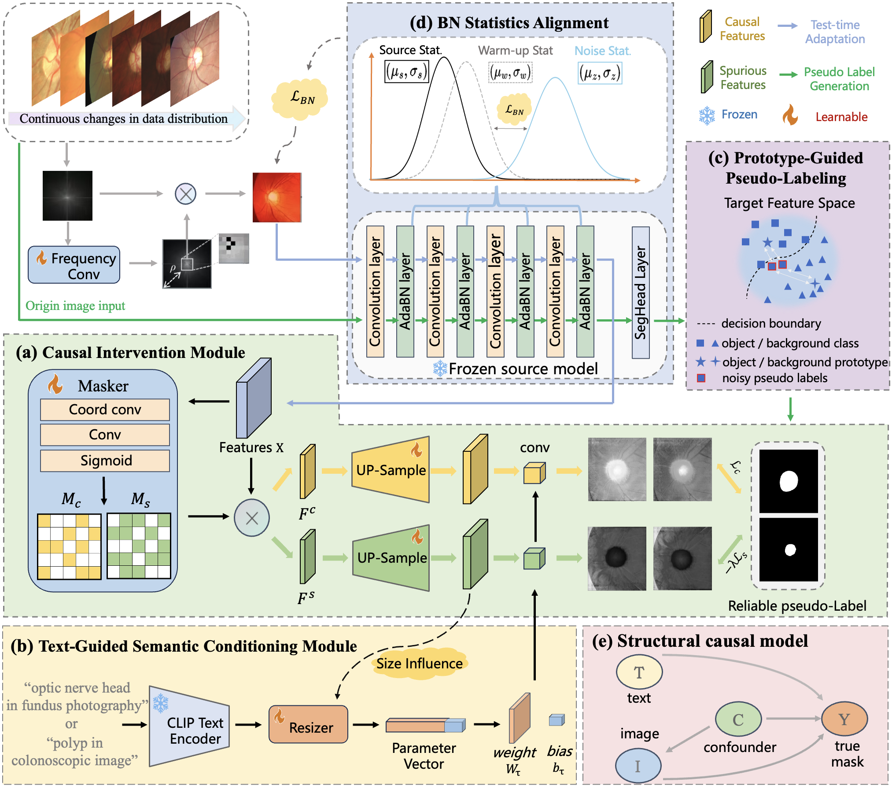

# C-TTA
This is the pytorch implementation of our CausalCTTA

<div align="center">
  
</div>

## Environment
```
CUDA 10.1
Python 3.7.0
Pytorch 1.8.0
CuDNN 8.0.5
```

## Data and model Preparation
The preprocessed data and the pre-trained models can be downloaded from [Google Drive](https://drive.google.com/drive/folders/1axgu3-65un-wA_1OH-tQIUIEHEDrnS_-?usp=drive_link) and [Google Drive](https://drive.google.com/drive/folders/1WWRbFLN3ELGbNs9jnl5bt4bIHuha8jWw?usp=drive_link) respectively.

## How to Run
Please first modify the root in ```example.sh``` and then run the following command to reproduce the results.

bash example.sh

## Acknowledgement
Parts of the code are based on the Pytorch implementations of [VPTTA](https://github.com/Chen-Ziyang/VPTTA) and [CausalCLIPSeg](https://github.com/WUTCM-Lab/CausalCLIPSeg).
