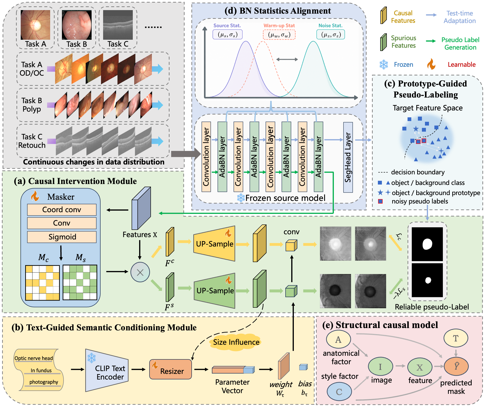

# CausalCTTA

Anonymous review release of the PyTorch implementation of CausalCTTA. This
package contains no repository history, author metadata, machine-specific
paths, datasets, checkpoints, generated masks, or experiment logs.

<div align="center">
  
</div>

## Environment

The verified environment uses Python 3.9, PyTorch 2.0.1, torchvision 0.15.2,
and CUDA 11.8. The original implementation used Python 3.7 and PyTorch 1.8.

Create the environment with:

```bash
conda env create -f environment.yml
conda activate causalctta
```

## Data and checkpoints

The anonymous supplementary data and checkpoint links are distributed
separately from this source archive. Arrange the extracted files as follows:

```text
example/
├── Fundus/
│   ├── RIM_ONE_r3/
│   ├── REFUGE/
│   ├── ORIGA/
│   ├── REFUGE_Valid/
│   ├── Drishti_GS/
│   └── *.csv
└── models/
    └── RIM_ONE_r3/
        └── last-Res_Unet.pth
```

## Run CausalCTTA

The default experiment uses RIM-ONE-r3 as the source domain:

```bash
bash example.sh
```

Metrics are written to `logs/results.txt` by default. The complete `logs/`
directory is ignored by Git and is never part of the source release.

Paths can be overridden without editing the script:

```bash
DATASET_ROOT=/path/to/Fundus \
MODEL_ROOT=/path/to/models \
LOG_ROOT=/path/to/logs \
bash example.sh
```

## Acknowledgement

Parts of this implementation build on the public VPTTA implementation.
